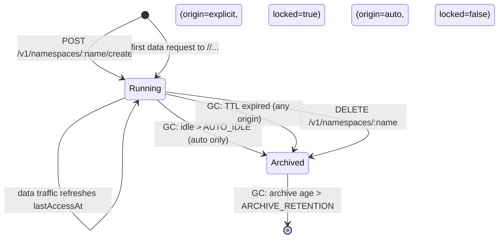

# turso-server

> Multi-tenant supervisor around the official `tursodb --sync-server` binary
> that exposes the namespace lifecycle semantics of `sqld` while keeping
> the data plane on Turso DB. Lives at [`apps/turso-server/`](../../apps/turso-server/).

`turso-server` is the answer to "how do we run many Turso DB databases in
one Kubernetes service?". Upstream `tursodb` (v0.6.0) only supports
`--sync-server <addr> <single-db-file>` — one process per database. Our
wrapper spawns one `tursodb` subprocess per namespace and routes traffic
to the right one based on the URL path. Clients see a single endpoint
that behaves like `sqld`: dynamic namespace creation/deletion plus
embedded-replica sync.

## When you need it

- Multi-pod Buntime deployments (`replicaCount > 1`) where `ApiKeyStore`
  and plugin-turso must share state across pods.
- Apps installed via the lowcode platform that create their own SQLite
  databases at runtime — each app gets its own namespace, fully isolated.
- Anywhere you want the `sqld` namespace API but the team has standardized
  on the `tursodatabase` toolchain (drivers + binary).

When `replicaCount=1` and you don't need dynamic databases, you can skip
the server entirely: set `buntime.authDb.mode=local` and let plugin-turso
default to `mode=local` with per-pod files.

## Architecture

```
┌─────────────────────────────────────────────────────────────────┐
│ Pod buntime-turso-0  (StatefulSet, 1 replica)                   │
│                                                                 │
│ ┌─────────────────────────────────────────────────────────────┐ │
│ │ turso-server (Go, PID 1)                                    │ │
│ │                                                             │ │
│ │  data :8080   ←  bearer TURSO_AUTH_TOKEN                    │ │
│ │   │                                                         │ │
│ │   ├── /<name>/<rest>  →  reverse-proxy to 127.0.0.1:<port>  │ │
│ │   └── auto-create on first hit (if allowed)                 │ │
│ │                                                             │ │
│ │  admin :8081  ←  bearer TURSO_ADMIN_TOKEN                   │ │
│ │   │                                                         │ │
│ │   ├── POST   /v1/namespaces/:name/create                    │ │
│ │   ├── DELETE /v1/namespaces/:name                           │ │
│ │   ├── GET    /v1/namespaces                                 │ │
│ │   ├── POST   /v1/namespaces/:name/{lock,unlock,ttl,access}  │ │
│ │   └── /healthz   /readyz                                    │ │
│ │                                                             │ │
│ │  GC goroutine (every TURSO_GC_INTERVAL):                    │ │
│ │   - archive auto-created idle > TURSO_AUTO_IDLE_DURATION    │ │
│ │   - archive TTL-expired namespaces                          │ │
│ │   - purge archive entries > TURSO_ARCHIVE_RETENTION         │ │
│ │                                                             │ │
│ │  supervisor:                                                │ │
│ │    map<name → {pid, port}>                                  │ │
│ │    per-name mutex to serialize concurrent first-touches     │ │
│ │    persists `_state/namespaces.json` after every change     │ │
│ └─────────────────────────────────────────────────────────────┘ │
│                                                                 │
│ /var/lib/turso/  (RWO PVC):                                     │
│   _state/namespaces.json   ← supervisor state                   │
│   api-keys.db, .db-wal     ← one db file per namespace          │
│   runtime.db,  ...                                              │
│   archive/<name>.<ts>/      ← GC archive bin                    │
│                                                                 │
│ Internal ports 9000-9999 (one tursodb each).                    │
└─────────────────────────────────────────────────────────────────┘
```

## Wire-level protocol

The data port speaks the same HTTP protocol the `@tursodatabase/sync`
client uses with `tursodb --sync-server`. The wrapper does **not**
participate in the sync protocol — it is a transparent reverse proxy.
That keeps it forward-compatible with any future tursodb protocol
revision: when the upstream client and server change their wire format,
the wrapper continues to work without changes.

Client URL form:

```
libsql://<release>-turso:8080/<namespace>
http://<release>-turso:8080/<namespace>    # same; both schemes accepted
```

The wrapper strips the `/<namespace>` prefix from the path before
forwarding to the internal port — the backing `tursodb` sees a
namespace-less URL.

## Configuration (env vars)

| Variable | Default | Purpose |
|---|---|---|
| `TURSO_DATA_ADDR` | `:8080` | Bind address for the data listener |
| `TURSO_ADMIN_ADDR` | `:8081` | Bind address for the admin listener |
| `TURSO_DATA_DIR` | `/var/lib/turso` | Where db files and state live |
| `TURSODB_BIN` | `/usr/local/bin/tursodb` | Path to the upstream `tursodb` binary |
| `TURSO_AUTH_TOKEN` | _empty (dev only)_ | Bearer token for the data port |
| `TURSO_ADMIN_TOKEN` | _empty (dev only)_ | Bearer token for the admin port |
| `TURSO_BACKEND_PORT_START` | `9000` | Lower bound of the internal port range |
| `TURSO_BACKEND_PORT_END` | `9999` | Upper bound of the internal port range |
| `TURSO_MAX_NAMESPACES` | `256` | Hard cap on concurrent namespaces (0 = unlimited) |
| `TURSO_ALLOW_AUTO_PROVISION` | `true` | Auto-create namespaces on first data-port hit |
| `TURSO_STARTUP_TIMEOUT` | `5s` | Max time to wait for a spawned tursodb to listen |
| `TURSO_GC_INTERVAL` | `1h` | How often the GC sweeps idle namespaces |
| `TURSO_AUTO_IDLE_DURATION` | `168h` (7d) | Auto-created namespaces idle longer than this are archived |
| `TURSO_ARCHIVE_RETENTION` | `720h` (30d) | Archive entries older than this are deleted |

Bearer tokens are sent via the standard `Authorization: Bearer <token>`
header. `/healthz` and `/readyz` are reachable without a token so the
kubelet probes do not require credentials.

## Namespace lifecycle



| Field | When set | Effect |
|---|---|---|
| `origin: explicit` | Set by `POST /create` | Default locked=true, GC ignores |
| `origin: auto`     | First data hit          | Default locked=false, GC eligible |
| `locked: true`     | Default for explicit, or `POST /lock` | Skips all GC rules |
| `ttl: "30d"`       | `POST /ttl` body        | GC archives when `createdAt + ttl < now` |
| `lastAccessAt`     | Every data request      | Auto-only idle threshold |

The `lastAccessAt` field is updated in-memory on every request and flushed
to disk on a 60-second debounce so the hot path is not bound by file
IO. Process crash within 60s of the last access can lose the bump
(no correctness impact — GC just sees a slightly older timestamp).

## Helm integration

The chart provisions everything when `tursoServer.enabled=true`. See
[`charts/templates/turso-server.yaml`](../../charts/templates/turso-server.yaml).

Two ClusterIP Services are exposed:

| Service | Port | Audience |
|---|---|---|
| `<release>-turso` | 8080 | Every runtime pod (workers + control plane) — data plane |
| `<release>-turso-admin` | 8081 | Runtime control plane + cpanel only — namespace lifecycle |

The admin port lives on a separate Service so it can be locked down with a
`NetworkPolicy` to restrict access to specific Pods. Without that policy,
any Pod with the admin token can mutate namespaces — see [Security](#security).

The chart wires three env vars into every Buntime pod when the server is
enabled:

| Env | Value (helm-rendered) | Used by |
|---|---|---|
| `RUNTIME_AUTH_DB_SYNC_URL` | `http://<release>-turso:8080/api-keys` | ApiKeyStore (control plane) |
| `TURSO_SERVER_URL` | `http://<release>-turso:8080` | plugin-turso multi-tenant mode |
| `TURSO_SERVER_ADMIN_URL` | `http://<release>-turso-admin:8081` | runtime/cpanel admin operations |

Tokens come from the runtime Secret (`<release>`):
`RUNTIME_AUTH_DB_SYNC_TOKEN` and `TURSO_SERVER_TOKEN` carry the data-plane
bearer; `TURSO_SERVER_ADMIN_TOKEN` carries the admin one (only mounted on
pods that need it).

## Disaster recovery

### Recommended: scheduled hot snapshots (CronJob)

When `tursoServer.backup.enabled=true`, the chart provisions a CronJob
(`<release>-turso-backup`) that runs the hot-backup endpoint on every
namespace and uploads the resulting `.db` files to S3-compatible
storage.

How it works:

1. The job lists namespaces via `GET /v1/namespaces` (admin API).
2. For each, it calls `GET /v1/namespaces/:name/backup` — turso-server
   issues `VACUUM INTO '<tmp>'` against the **live** tursodb process. This
   uses the same connection that holds the file lock, so the snapshot is
   transactionally consistent **with zero downtime**.
3. The response body (a plain SQLite file) is streamed straight into S3
   via `mc pipe`.
4. Older snapshots beyond `retentionCount` are pruned per namespace.

Default schedule is `0 2 * * *` (daily at 02:00 UTC) and 14 retained
snapshots per namespace. Both are values overridable via Helm.

### Restoring

Snapshots in S3 are regular SQLite files. To recover after PVC loss:

1. Re-install the release with `tursoServer.enabled=true`.
2. Run a Job that mounts `data-<release>-turso-0` and copies the latest
   snapshot for each namespace from S3 into `/var/lib/turso/<name>.db`.
3. **Chown the restored files to UID 9000** (the `turso` user inside
   the image) — copies land as `root:root` by default.
4. Restart the turso-server Pod so the supervisor picks the files up.

**Known limitation — sync semantics on live cluster restore.** The
restored `.db` file contains all rows and the schema, but it does **not**
contain CDC log entries (VACUUM INTO copies data, not the change-data-
capture stream). Embedded replica clients connecting after the restore
see an empty change log on the primary side and conclude there are no
changes to pull — even though the rows are there. Two workarounds today:

- **Offline recovery**: read the snapshot with a standalone `tursodb`
  shell to extract data; re-insert into a fresh deployment via SQL.
  Use this for incident postmortems, not for service restore.
- **Live restore**: after copying the file into place, manually clear
  `turso_sync_last_change_id` and the `turso_cdc*` tables so the next
  client connect triggers a full state bootstrap. This is destructive
  for in-flight replicas (they will re-bootstrap too).

A proper "online restore" (cluster keeps running, all replicas converge
on the restored state) requires either an upstream tursodb feature or
an enhancement to our wrapper. Tracked as a follow-up.

### Why Litestream does NOT work here

Litestream is incompatible with `tursodb --sync-server` and the chart
switch `tursoServer.litestream.enabled` is kept only for operators who
want to experiment with future versions. The root cause:

- Litestream opens the `.db` file via a separate `sqlite3` connection
  to read WAL frames and create its `_litestream_*` tracking tables.
- `tursodb --sync-server` holds the file in **exclusive** mode (CDC +
  MVCC). The second connection cannot acquire any lock.
- Result: `database is locked (5) (SQLITE_BUSY)` in a tight retry loop;
  **zero bytes** make it to the bucket.

The snapshot CronJob above is the supported alternative.

### PVC-level snapshots

When the storage class supports VolumeSnapshot (Longhorn, Ceph-RBD, EBS,
etc.), prefer those for whole-cluster restore — they capture state +
CDC log atomically. The `local-path` provisioner used in our home lab
does not support snapshots, which is why we built the file-level
backup path.

## Security

- **Data and admin tokens are mandatory in production.** Empty tokens
  disable auth and are intended only for `bun dev` / local docker runs.
- Workers and plugins receive **only** the data token. Compromising a
  worker should not let the attacker drop other tenants' namespaces.
- The admin token is mounted on the runtime control plane (and the
  cpanel admin route) — anywhere that owns the namespace lifecycle.
- The admin port runs on a separate ClusterIP Service. Pair it with a
  `NetworkPolicy` to allow only the runtime ServiceAccount to reach it.
- Namespace names are validated against `^[a-z0-9][a-z0-9_-]{0,62}$`
  to prevent path traversal when files are written to disk.
  Underscore-prefixed names are reserved for internal use (`_state`).

## Observability

The wrapper emits structured JSON logs on stdout via `log/slog`:

```json
{"time":"...","level":"INFO","msg":"namespace running","name":"api-keys","port":9000,"pid":12,"origin":"auto"}
{"time":"...","level":"INFO","msg":"gc archive","name":"app-stale","reason":"auto-created idle > 168h0m0s"}
{"time":"...","level":"WARN","msg":"upstream error","path":"/foo/...","err":"..."}
```

Output from each spawned `tursodb` is prefixed with `tursodb.<namespace>`
so subprocess logs are easy to correlate.

Metrics: not implemented yet (follow-up). The supervisor maintains
counters internally; exposing them via Prometheus is a small follow-up.

## Limits and trade-offs

- **Single-replica StatefulSet.** Each namespace is single-writer — no
  HA. To survive node loss, Litestream + a healthy storage class are
  required. True multi-primary would need an upstream Turso DB feature.
- **One `tursodb` process per namespace.** Each process is ~30 MB RSS
  idle. 256-namespace cap keeps the supervisor well under 10 GB total.
- **Internal port range bounded** to `9000-9999`. Tune via
  `TURSO_BACKEND_PORT_START`/`_END` if you need more.
- **No connection pooling.** Each request to the data port becomes one
  outbound HTTP request to the backend tursodb. This matches upstream
  `tursodb --sync-server` which is also stateless per-request.
- **Bearer token only.** No mTLS, no per-namespace tokens. Adequate for
  in-cluster traffic behind a NetworkPolicy.

## Build and release

The image is built from [`apps/turso-server/Dockerfile`](../../apps/turso-server/Dockerfile):

```sh
cd apps/turso-server
docker buildx build --platform=linux/arm64,linux/amd64 \
  -t ghcr.io/zommehq/turso-server:0.1.0 \
  -t ghcr.io/zommehq/turso-server:latest .
docker push ghcr.io/zommehq/turso-server:0.1.0
docker push ghcr.io/zommehq/turso-server:latest
```

Multi-arch is supported (debian:bookworm-slim base on both archs). The
upstream `tursodb` binary is fetched from the official GitHub release
during build — bump `TURSODB_VERSION` to upgrade.

## Related

- [`apps/turso-server/README.md`](../../apps/turso-server/README.md) —
  build/run quick start
- [`wiki/apps/plugin-turso.md`](../apps/plugin-turso.md) — plugin-turso
  multi-tenant mode
- [`wiki/apps/runtime-api-reference.md`](../apps/runtime-api-reference.md)
  — ApiKeyStore sync mode
- [`wiki/ops/multi-pod-deployment.md`](./multi-pod-deployment.md) —
  end-to-end multi-pod guide
- [Turso DB releases](https://github.com/tursodatabase/turso/releases)
- [`@tursodatabase/sync` npm](https://www.npmjs.com/package/@tursodatabase/sync)
